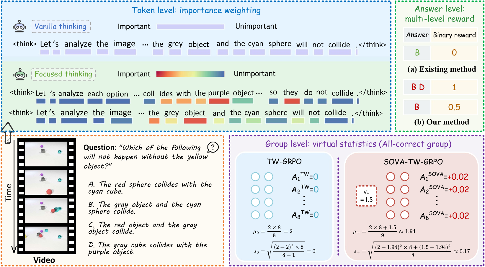
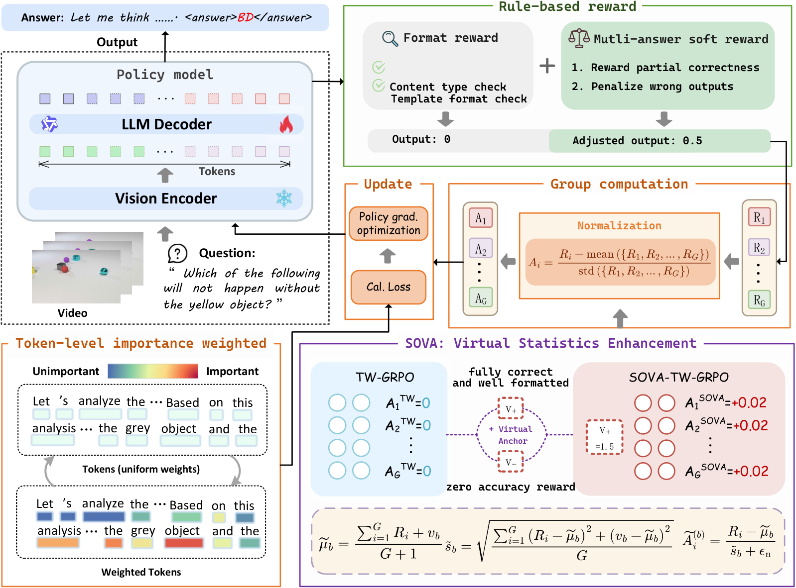
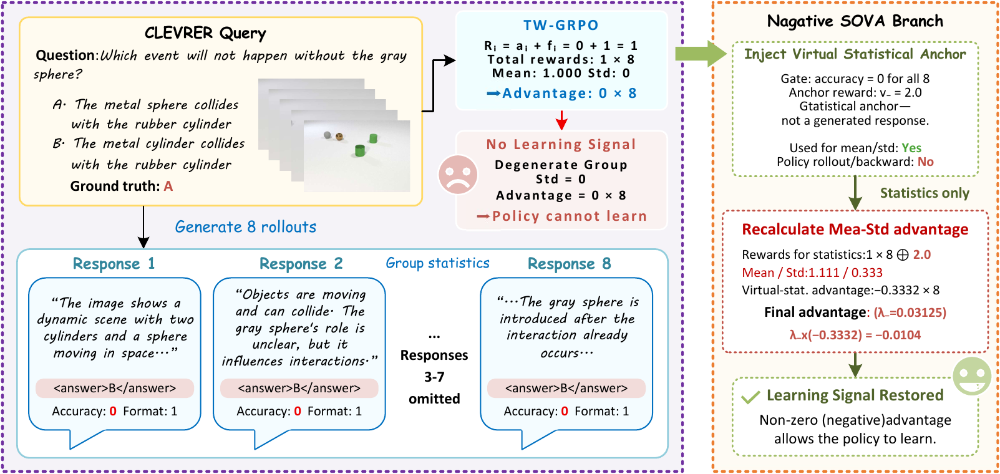

<div align="center">

# SOVA-TW-GRPO

### Reinforcing Video Reasoning with Focused Thinking via Three Granularities:<br/>Tokens, Answer Sets, and Response Groups

</div>

---

Source release for **SOVA-TW-GRPO**, a group-relative reinforcement learning framework for video
reasoning that allocates credit at **three complementary granularities**: individual **tokens**,
**answer sets**, and whole **response groups**.

It extends **TW-GRPO** (ECCV 2026, *Reinforcing Video Reasoning with Focused Thinking*) with
**SOVA** (*Strict Outcome-Conditioned Virtual Advantages*), which restores a directional learning
signal in response groups whose outcomes are homogeneous, a failure mode inherited from
group-relative normalization.

## Contents

- [Method at a glance](#method-at-a-glance)
- [What SOVA adds](#what-sova-adds)
- [Paper-to-code map](#paper-to-code-map)
- [Repository layout](#repository-layout)
- [Setup](#setup)
- [Training](#training)
- [Evaluation](#evaluation)
- [Question-Answer Inversion (QAI)](#question-answer-inversion-qai)
- [Acknowledgements](#acknowledgements)
- [Citation](#citation)

## Method at a glance

<p align="center">
  
</p>

Group Relative Policy Optimization scores a whole response by the correctness of its final answer
and normalizes that score within a sampled group. One scalar is therefore shared by every token of
a reasoning chain, by every answer that is not exactly correct, and by every response of a group
whose outcomes agree. SOVA-TW-GRPO refines credit assignment at each of those three levels.

| Granularity | Mechanism | Effect | Introduced in |
| :-- | :-- | :-- | :-- |
| **Token** | Importance weighting from intra-group information entropy | Prioritizes tokens with high information density over generic scaffolding | TW-GRPO (ECCV 2026) |
| **Answer set** | Multi-level soft reward over multi-answer QA, with Question-Answer Inversion for data augmentation | Distinguishes partial correctness instead of a binary 0/1 signal | TW-GRPO (ECCV 2026) |
| **Response group** | **SOVA**: strict outcome-conditioned virtual advantages | Restores a directional signal where group-relative normalization collapses | **This work** |

## What SOVA adds

<p align="center">
  
</p>

When every response in a sampled group is fully correct and well formatted, or when none earns any
accuracy credit, the group-relative advantage is zero for every response and no gradient survives,
precisely at the outcome extremes that carry the clearest correctness evidence. Token weighting
and soft rewards cannot recover it, because both act on an advantage that has already vanished.

SOVA inserts a **signed virtual anchor** into the group-normalization statistics on those two
strict conditions only. The anchor contributes no response tokens; it shifts only the mean and
standard deviation used to normalize the real responses. The corrected advantage is a **residual
interpolation** between the frozen TW-GRPO advantage and the virtual-statistics advantage,
controlled by a per-branch coefficient `lambda`.

| Branch | Gate condition | Anchor, relative to the group's common reward | Induced signal |
| :-- | :-- | :-- | :-- |
| **Positive** | Every response fully correct **and** well formatted | `1.5`, below the common reward of `2.0` | Positive advantage |
| **Negative** | No response earns accuracy credit | `2.0`, above the common reward (`f_i <= 1`) | Negative advantage |

<p align="center">
  
</p>

The anchors set only a **direction**, not a magnitude: the induced group-level shift is known in
closed form, is bounded independently of the anchor value, and preserves the reward ordering among
sampled responses. Treat `SOVA_POSITIVE_VIRTUAL_TOTAL_REWARD` and
`SOVA_NEGATIVE_VIRTUAL_TOTAL_REWARD` as semantic constants rather than strength knobs; use
`lambda` to control the strength.

## Paper-to-code map

Code paths are relative to `src/open_r1/` unless shown otherwise.

| Paper | Component | Code | Flag |
| :-- | :-- | :-- | :-- |
| Sec. III-B | Token importance weight `w_t` from intra-group KL divergence | [`trainer/grpo_trainer.py`](src/open_r1/trainer/grpo_trainer.py) → `compute_token_importance_kl_logs_uniform()` | `--alpha` |
| Sec. III-C, Eq. (7) | Multi-level soft accuracy reward | [`grpo.py`](src/open_r1/grpo.py) → `accuracy_reward()`, `origin_accuracy_reward()`, `format_reward()` | `--reward_funcs`, `--question_type` |
| Sec. III-C | Question-Answer Inversion (QAI) | [`data/question_answer_inverse/`](data/question_answer_inverse/) | |
| Sec. III-D, Eq. (10), (17) | Strict outcome gates and residual interpolation | [`sova.py`](src/open_r1/sova.py) → `apply_sova_advantages()`, `_virtual_group_statistics()` | |
| Sec. IV | Configuration validity conditions | [`sova.py`](src/open_r1/sova.py) → `validate_sova_configuration()` | |
| Sec. II-C, Table I | NGRPO and AVSPO baselines for degenerate advantage groups | [`grpo_variants.py`](src/open_r1/grpo_variants.py) → `compute_ngrpo_advantages()` | `--loss_type` |

## Repository layout

```
SOVA-TW-GRPO/
├── configs/
├── data/
│   └── question_answer_inverse/
├── docs/
│   └── figs/
├── example/
│   └── tutorial/
├── scripts/
├── src/
│   ├── eval/
│   └── open_r1/
│       └── trainer/
└── tests/
```

## Setup

> [!NOTE]
> The training commands below are configured for one node with 2 x H800 (80 GB).
> Training for 500 steps takes roughly 4 hours.

### Step 1: Environment

```bash
git clone https://github.com/just-a-go/SOVA-TW-GRPO.git
cd SOVA-TW-GRPO
conda create -n sova-tw-grpo python=3.10
conda activate sova-tw-grpo
pip3 install -e ".[dev]"
pip3 install flash_attn --no-build-isolation
pip3 install "qwen-vl-utils>=0.0.10" decord
```

### Step 2: Model backbone

```bash
pip install -U huggingface_hub
huggingface-cli download --resume-download Qwen/Qwen2.5-VL-7B-Instruct \
  --local-dir Qwen/Qwen2.5-VL-7B-Instruct
```

### Step 3: Training data (CLEVRER)

Training uses the counterfactual split of CLEVRER. Annotations and videos are not bundled;
download them from the official source into your local `data/CLEVRER` directory.

```bash
mkdir -p data/CLEVRER/{train_video,validation_video}

wget -P data/CLEVRER/train_video http://data.csail.mit.edu/clevrer/videos/train/video_train.zip
unzip data/CLEVRER/train_video/video_train.zip -d data/CLEVRER/train_video
rm data/CLEVRER/train_video/video_train.zip

wget -P data/CLEVRER/validation_video http://data.csail.mit.edu/clevrer/videos/validation/video_validation.zip
unzip data/CLEVRER/validation_video/video_validation.zip -d data/CLEVRER/validation_video
rm data/CLEVRER/validation_video/video_validation.zip
```

### Step 4: Evaluation data (optional)

Skip this step if you only want to reproduce the CLEVRER results.

| Dataset | Link |
| :-- | :-- |
| NExT-QA | [huggingface.co/datasets/lmms-lab/NExTQA](https://huggingface.co/datasets/lmms-lab/NExTQA) |
| MMVU | [huggingface.co/datasets/yale-nlp/MMVU](https://huggingface.co/datasets/yale-nlp/MMVU) |
| MVBench | [huggingface.co/datasets/OpenGVLab/MVBench](https://huggingface.co/datasets/OpenGVLab/MVBench) |
| TempCompass | [huggingface.co/datasets/lmms-lab/TempCompass](https://huggingface.co/datasets/lmms-lab/TempCompass) |
| Video-MME | [huggingface.co/datasets/lmms-lab/Video-MME](https://huggingface.co/datasets/lmms-lab/Video-MME) |
| STAR | [modelscope.cn/datasets/Video-R1/Video-R1-data](https://modelscope.cn/datasets/Video-R1/Video-R1-data/files) |

## Training

```bash
CUDA_VISIBLE_DEVICES=0,1 bash scripts/sova-tw-grpo.sh
```

The launcher takes no arguments; configure a run in the paths and selector blocks at the top of
the script. The paths there are placeholders, so set them first.

### Method selector

| `LOSS_TYPE` | Method | Reward functions | SOVA |
| :-- | :-- | :-- | :-- |
| `tw_grpo` | TW-GRPO, optionally with SOVA | `accuracy` (soft) + `format` | Available |
| `grpo` | Standard GRPO | `origin_accuracy` (binary) | Off |
| `ngrpo` | NGRPO baseline | `origin_accuracy` (binary) | Off |
| `avspo` | AVSPO baseline | `origin_accuracy` (binary) | Off |

SOVA requires `LOSS_TYPE="tw_grpo"`; the trainer rejects any other combination.

### SOVA settings

| Variable | Values | Meaning |
| :-- | :-- | :-- |
| `SOVA_MODE` | `positive` / `negative` / `bidirectional` | Which gate(s) are active |
| `SOVA_LAMBDA_POSITIVE` | `[0, 1]` | Interpolation weight of the positive branch |
| `SOVA_LAMBDA_NEGATIVE` | `[0, 1]` | Interpolation weight of the negative branch |
| `SOVA_POSITIVE_VIRTUAL_TOTAL_REWARD` | `1.5` (default) | Positive anchor (semantic constant, keep fixed) |
| `SOVA_NEGATIVE_VIRTUAL_TOTAL_REWARD` | `2.0` (default) | Negative anchor (semantic constant, keep fixed) |

A `lambda` must be strictly positive exactly when its branch is enabled; `validate_sova_configuration()`
fails closed on any other combination.

### Other training options

| Flag | Values | Meaning |
| :-- | :-- | :-- |
| `--question_type` | `mixed` (default) / `single` | Multi-answer or single-choice QA |
| `--alpha` | `1.70` (default) | Upper bound of the token importance weight |
| `--reward_funcs` | `accuracy` / `origin_accuracy` / `format` | Soft or binary accuracy, plus format reward |
| `--jsonl_path` | path | Training or evaluation JSON |
| `--num_generations` | `8` (default) | Group size `G` |

To reproduce the conference configuration instead, run `bash scripts/tw-grpo.sh`.

## Evaluation

Accuracy (%) on video reasoning and general video understanding benchmarks. Every
reinforcement-learning row shares the same 1000-sample CLEVRER training budget and differs only in
the advantage estimator; the paper reports the full comparison against external baselines.

<table>
  <thead>
    <tr>
      <th rowspan="2" align="left">Model</th>
      <th rowspan="2" align="center">Training</th>
      <th colspan="3" align="center">Video Reasoning</th>
      <th colspan="3" align="center">General Video Understanding</th>
    </tr>
    <tr>
      <th align="center">CLEVRER</th>
      <th align="center">NExT-GQA</th>
      <th align="center">MMVU</th>
      <th align="center">MVBench</th>
      <th align="center">TempCompass</th>
      <th align="center">Video-MME</th>
    </tr>
  </thead>
  <tbody>
    <tr>
      <td align="left">Qwen2.5-VL-7B (zero-shot)</td>
      <td align="center">&ndash;</td>
      <td align="center">30.5</td>
      <td align="center">75.9</td>
      <td align="center">65.4</td>
      <td align="center">63.3</td>
      <td align="center">72.5</td>
      <td align="center">56.5</td>
    </tr>
    <tr>
      <td align="left">GRPO</td>
      <td align="center">1000 RL</td>
      <td align="center">41.1</td>
      <td align="center">75.2</td>
      <td align="center">65.1</td>
      <td align="center">62.8</td>
      <td align="center">71.9</td>
      <td align="center">55.9</td>
    </tr>
    <tr>
      <td align="left">NGRPO</td>
      <td align="center">1000 RL</td>
      <td align="center">42.3</td>
      <td align="center">75.0</td>
      <td align="center">64.9</td>
      <td align="center">62.9</td>
      <td align="center">71.8</td>
      <td align="center">55.6</td>
    </tr>
    <tr>
      <td align="left">AVSPO</td>
      <td align="center">1000 RL</td>
      <td align="center">43.2</td>
      <td align="center">75.4</td>
      <td align="center">65.2</td>
      <td align="center">63.1</td>
      <td align="center">72.1</td>
      <td align="center">55.9</td>
    </tr>
    <tr>
      <td align="left">TW-GRPO</td>
      <td align="center">1000 RL</td>
      <td align="center">50.4</td>
      <td align="center">76.1</td>
      <td align="center">65.8</td>
      <td align="center">63.3</td>
      <td align="center"><b>73.3</b></td>
      <td align="center">55.1</td>
    </tr>
    <tr>
      <td align="left"><b>SOVA-TW-GRPO</b></td>
      <td align="center">1000 RL</td>
      <td align="center"><b>51.9</b></td>
      <td align="center"><b>76.7</b></td>
      <td align="center"><b>65.9</b></td>
      <td align="center"><b>64.4</b></td>
      <td align="center"><b>73.3</b></td>
      <td align="center"><b>56.9</b></td>
    </tr>
  </tbody>
</table>

Reproduce these numbers with the evaluation entry points below.

```bash
bash scripts/eval-sova-tw-grpo.sh    # SOVA-TW-GRPO on video reasoning benchmarks
bash scripts/eval-sova-general.sh    # General video understanding benchmarks
bash scripts/evaluate.sh             # Conference-version evaluation entry point
```

TW-GRPO checkpoints are available at [Falconss1/TW-GRPO](https://huggingface.co/Falconss1/TW-GRPO).

Case studies comparing reasoning paths against [Video-R1](https://github.com/tulerfeng/Video-R1)
are collected in [`example/performance_comparison.md`](example/performance_comparison.md).

## Question-Answer Inversion (QAI)

QAI converts single-choice QA into multi-answer QA by negating the question and inverting the
answer set, which supplies the multi-level reward with training data. A worked example is given in
[`example/tutorial/qai_tutorial.md`](example/tutorial/qai_tutorial.md).

```bash
python data/question_answer_inverse/convert_nextgqa.py   # NExT-GQA
python data/question_answer_inverse/convert_star.py      # STAR
```

Outputs are written to your local `data/evaluation/` directory as `nextgqa_val_mixed.json` and
`STAR_mixed.json`.

## Acknowledgements

This work builds on the open-source community, in particular
[Open-R1-Video](https://github.com/Wang-Xiaodong1899/Open-R1-Video),
[Video-R1](https://github.com/tulerfeng/Video-R1) and
[VideoChat-R1](https://github.com/OpenGVLab/VideoChat-R1).

## Citation

If you find this project useful, please consider citing the conference version, [arXiv:2505.24718](https://arxiv.org/abs/2505.24718):

```bibtex
@inproceedings{dang2026reinforcing,
  title     = {Reinforcing Video Reasoning with Focused Thinking},
  author    = {Dang, Jisheng and Wu, Jingze and Wang, Teng and Lin, Xuanhui and
               Zhu, Nannan and Chen, Hongbo and Zheng, Wei-Shi and Wang, Meng and
               Chua, Tat-Seng},
  booktitle = {European Conference on Computer Vision (ECCV)},
  publisher = {Springer},
  year      = {2026},
  note      = {arXiv:2505.24718}
}
```

ECCV 2026 takes place 10-12 September 2026; page numbers and the DOI will be added to this entry
once the proceedings are published. The journal extension introducing SOVA is under review and
this section will be updated once it has a citable reference.

## License

Released under the [Apache License 2.0](LICENSE).
